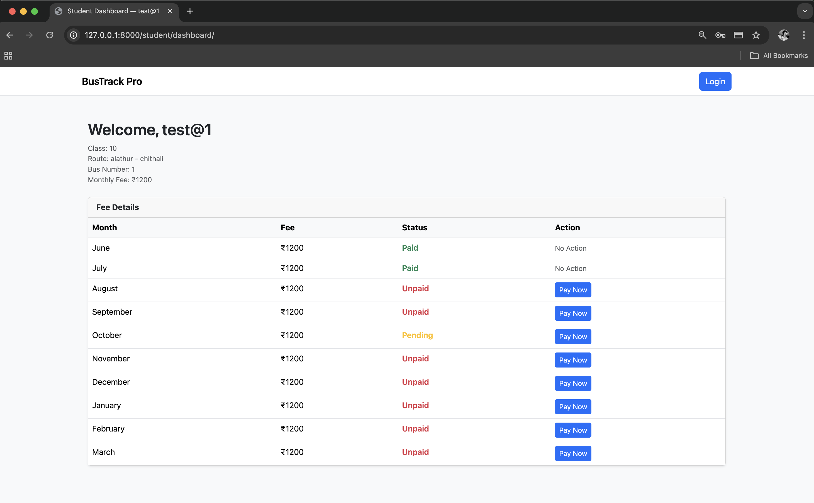
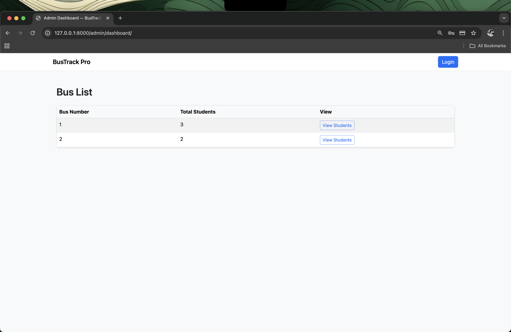
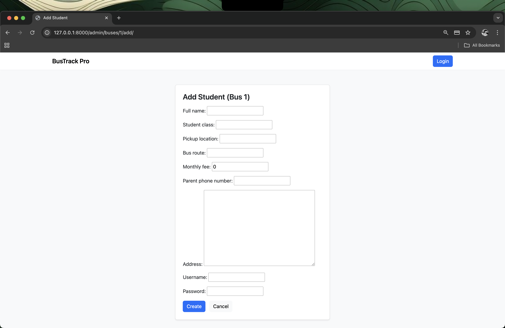
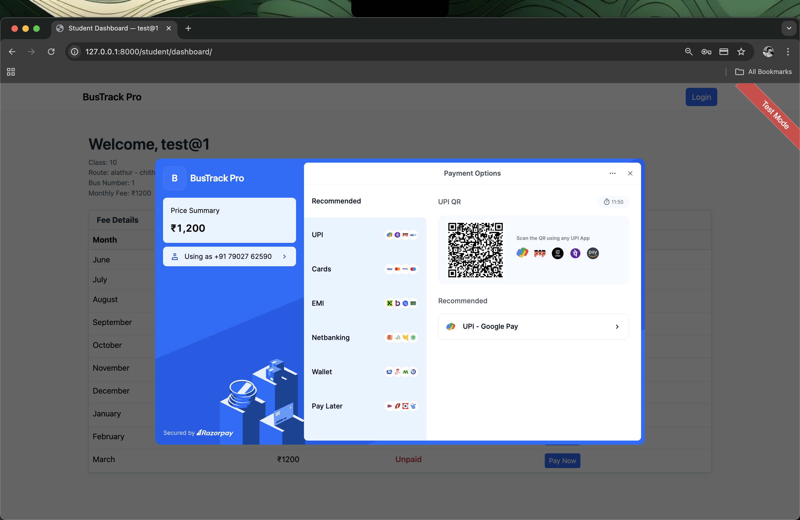

# Bus Fee Portal

A comprehensive Django-based web application for managing school bus fees, student grouping by bus routes, and online payment processing through Razorpay integration.


---

## Table of Contents

- [About](#about)
- [Features](#features)
- [Tech Stack](#tech-stack)
- [Installation](#installation)
- [Configuration](#configuration)
- [Usage](#usage)
- [Database Models](#database-models)
- [Payment Flow](#payment-flow)
- [Project Structure](#project-structure)
- [Screenshots](#screenshots)
- [Future Enhancements](#future-enhancements)
- [Contributing](#contributing)
- [License](#license)
- [Contact](#contact)

---

## About

The Bus Fee Portal is a full-stack web application built to streamline the management of student transportation fees in educational institutions. The system provides separate dashboards for administrators and students, enabling efficient fee tracking, secure payment processing, and organized student management by bus routes.

This project demonstrates practical implementation of payment gateway integration, webhook handling for payment verification, role-based access control, and automated fee record generation in a production-ready Django application.

---

## Features

### Student Portal

- Secure authentication system with credentials managed by administrators
- Personalized dashboard displaying complete fee history
- Monthly fee records covering the academic year from June to March
- Integrated online payment system supporting multiple payment methods including cards, UPI, and digital wallets
- Real-time payment status updates with automatic record synchronization
- Responsive design compatible with desktop and mobile devices

### Administrator Portal

**Student Management and Grouping**

- Comprehensive bus management interface displaying all active routes
- Student organization by bus numbers with visual count indicators
- Direct student addition within specific bus routes with automatic bus number assignment
- Complete student profile management including edit and delete operations
- Confirmation dialogs for critical actions to prevent accidental data loss

**Payment and Fee Management**

- Detailed view of all fee records across students and months
- Manual status override capabilities for Paid, Unpaid, and Pending states
- Transaction tracking with Razorpay payment IDs and timestamps
- Integrated signature verification for payment authenticity
- Webhook-based payment confirmation for enhanced reliability

**Dashboard and Analytics**

- Bus-wise student distribution overview
- Quick access to student counts per route
- Centralized navigation for all administrative functions

---

## Tech Stack

**Backend Framework**
- Django 5.2
- Python 3.x
- SQLite for development environment
- PostgreSQL compatible for production deployment

**Frontend Technologies**
- HTML5, CSS3, JavaScript
- Bootstrap framework for responsive layouts

**Payment Integration**
- Razorpay Payment Gateway API
- Razorpay Webhooks for asynchronous payment verification

**Security and Configuration**
- Django CSRF protection
- Environment-based configuration management
- Razorpay signature verification protocol
- Webhook secret validation

---

## Installation

### Prerequisites

Ensure you have the following installed on your system:
- Python 3.8 or higher
- pip package manager
- Git version control

### Setup Instructions

**Step 1: Clone the repository**

```bash
git clone https://github.com/AbhijithX001/bus-fee-portal.git
cd bus-fee-portal
```

**Step 2: Create and activate virtual environment**

```bash
python -m venv venv

# On Linux/Mac
source venv/bin/activate

# On Windows
venv\Scripts\activate
```

**Step 3: Install required dependencies**

```bash
pip install -r requirements.txt
```

**Step 4: Configure environment variables**

Create a `.env` file in the project root directory with the following variables:

```env
SECRET_KEY=your_django_secret_key_here
RAZORPAY_KEY_ID=your_razorpay_key_id
RAZORPAY_KEY_SECRET=your_razorpay_key_secret
RAZORPAY_WEBHOOK_SECRET=your_webhook_secret_key
DEBUG=True
```

**Step 5: Run database migrations**

```bash
python manage.py makemigrations
python manage.py migrate
```

**Step 6: Create administrator account**

```bash
python manage.py createsuperuser
```

Follow the prompts to set up your admin credentials.

**Step 7: Start development server**

```bash
python manage.py runserver
```

Access the application at `http://127.0.0.1:8000/`

---

## Configuration

### Razorpay Integration Setup

1. Create an account on the [Razorpay Dashboard](https://dashboard.razorpay.com/)
2. Navigate to Settings and then API Keys to generate your credentials
3. Copy the Key ID and Key Secret to your `.env` file
4. Configure webhook endpoint in Razorpay Dashboard:
   - Webhook URL: `https://yourdomain.com/webhook/razorpay/`
   - Active Events: `payment.captured`, `payment.failed`
5. Copy the webhook secret and add it to your `.env` file

### Production Deployment Checklist

Before deploying to production, ensure the following:

- Set `DEBUG=False` in environment variables
- Configure `ALLOWED_HOSTS` with your domain name
- Migrate to PostgreSQL or MySQL database
- Run `python manage.py collectstatic` to gather static files
- Deploy using Gunicorn or uWSGI with Nginx as reverse proxy
- Enable HTTPS using SSL certificates (mandatory for Razorpay)
- Set up proper logging and monitoring

---

## Usage

### Administrator Workflow

1. Log in using superuser credentials created during setup
2. Access the Bus Management section to view all registered bus routes
3. Select a specific bus to view students assigned to that route
4. Use the Add Student button to register new students. The bus number field will be automatically populated
5. Manage existing student records using the Edit and Delete action buttons
6. Monitor fee payment status from the student list or individual student profiles

### Student Workflow

1. Log in using credentials provided by the school administrator
2. View the personal dashboard showing all monthly fee records from June to March
3. Identify unpaid months and click the Pay Now button to initiate payment
4. Complete the transaction through the Razorpay payment interface
5. Upon successful payment, the system automatically updates the fee status to Paid
6. Payment confirmation is displayed along with transaction details

---

## Database Models

### User Model (Custom)

Handles authentication and role-based access control.

**Fields:**
- username: Unique identifier for login
- password: Hashed password storage
- role: Designates user type (admin or student)

### StudentProfile Model

Stores comprehensive student information and bus assignment details.

**Fields:**
- user: One-to-one relationship with User model
- full_name: Student's complete name
- student_class: Academic class or grade
- bus_number: Assigned bus route number
- pickup_location: Student's pickup point
- bus_route: Descriptive route information
- monthly_fee: Standard monthly fee amount
- parent_phone_number: Contact number for guardians
- address: Residential address

**Automated Functionality:**
- Automatically generates fee records for all months (June to March) upon student creation

### FeeRecord Model

Tracks monthly fee status for each student.

**Fields:**
- student_profile: Foreign key linking to StudentProfile
- month: Month name (June through March)
- amount: Fee amount for the month
- status: Current payment status (paid, unpaid, or pending)
- payment_date: Timestamp of successful payment
- transaction_id: Razorpay payment identifier
- verification_status: Payment verification state

### PaymentOrder Model

Maintains detailed logs of all Razorpay transactions.

**Fields:**
- student: Reference to student making payment
- fee_record: Associated fee record being paid
- month: Month for which payment is made
- amount: Transaction amount
- order_id: Razorpay order identifier
- payment_id: Razorpay payment identifier
- signature: Razorpay signature for verification
- status: Current transaction status

---

## Payment Flow

The payment process follows a secure multi-step verification approach:

1. **Order Initiation**: Student clicks Pay Now button on unpaid fee record
2. **Order Creation**: Django backend sends request to Razorpay API to create a new order
3. **Payment Interface**: Razorpay popup opens with order details and payment options
4. **Payment Processing**: Student completes payment using preferred method
5. **Response Handling**: Razorpay returns payment details including order_id, payment_id, and signature
6. **Signature Verification**: Django backend verifies the signature using Razorpay secret key
7. **Status Update**: Fee record status is updated to Paid upon successful verification
8. **Webhook Confirmation**: Razorpay webhook sends additional confirmation to ensure data integrity

### Webhook Security Features

- Validates incoming webhook requests using signature verification
- Ensures payment accuracy even if the user closes the browser during transaction
- Prevents duplicate payment processing through transaction ID tracking
- Provides 100% payment verification guarantee through dual confirmation system

---

## Project Structure

```
bus_fee_portal/
├── bus_fee_portal/
│   ├── settings.py          # Project configuration
│   ├── urls.py              # Main URL routing
│   └── wsgi.py              # WSGI configuration
├── core/
│   ├── models.py            # Database models
│   ├── views.py             # View logic
│   ├── forms.py             # Form definitions
│   ├── urls.py              # App-specific URLs
│   └── templates/
│       ├── admin/           # Admin dashboard templates
│       └── student/         # Student portal templates
├── screenshots/             # Project screenshots
├── venv/                    # Virtual environment
├── .env                     # Environment variables (not in repo)
├── .gitignore              # Git ignore rules
├── requirements.txt         # Python dependencies
├── manage.py               # Django management script
├── LICENSE                 # MIT License
└── README.md               # Project documentation
```

---

## Screenshots

### Student Dashboard


### Bus List (Admin View)


### Students Under Bus Route


### Add Student Interface


### Razorpay Payment Window


---

## Future Enhancements

The following features are planned for future releases:

- SMS notification system for fee reminders and payment confirmations
- Automated email receipts after successful payment
- Student attendance tracking for bus routes
- GPS-based live bus tracking integration
- Parent portal for managing multiple children's accounts
- Fee discount and scholarship management system
- Export functionality for fee reports in PDF and Excel formats
- Multi-language support for broader accessibility
- Native mobile applications using React Native or Flutter
- Advanced analytics dashboard with payment trends and insights

---

## Contributing

Contributions to improve the Bus Fee Portal are welcome. To contribute:

1. Fork the repository on GitHub
2. Create a new feature branch: `git checkout -b feature/YourFeatureName`
3. Make your changes and commit them: `git commit -m 'Add detailed description of changes'`
4. Push to your branch: `git push origin feature/YourFeatureName`
5. Submit a Pull Request with a comprehensive description of your changes

Please ensure your code follows Django best practices and includes appropriate documentation.

---

## License

This project is licensed under the MIT License. See the [LICENSE](LICENSE) file for complete details.

MIT License

Copyright (c) 2025 Abhijith Prakash

Permission is hereby granted, free of charge, to any person obtaining a copy of this software and associated documentation files (the "Software"), to deal in the Software without restriction, including without limitation the rights to use, copy, modify, merge, publish, distribute, sublicense, and/or sell copies of the Software, and to permit persons to whom the Software is furnished to do so, subject to the following conditions:

The above copyright notice and this permission notice shall be included in all copies or substantial portions of the Software.

THE SOFTWARE IS PROVIDED "AS IS", WITHOUT WARRANTY OF ANY KIND, EXPRESS OR IMPLIED, INCLUDING BUT NOT LIMITED TO THE WARRANTIES OF MERCHANTABILITY, FITNESS FOR A PARTICULAR PURPOSE AND NONINFRINGEMENT. IN NO EVENT SHALL THE AUTHORS OR COPYRIGHT HOLDERS BE LIABLE FOR ANY CLAIM, DAMAGES OR OTHER LIABILITY, WHETHER IN AN ACTION OF CONTRACT, TORT OR OTHERWISE, ARISING FROM, OUT OF OR IN CONNECTION WITH THE SOFTWARE OR THE USE OR OTHER DEALINGS IN THE SOFTWARE.

---

## Contact

**Author:** Abhijith Prakash

**GitHub:** [https://github.com/AbhijithX001](https://github.com/AbhijithX001)

**Email:** abhijithprakash22334a@gmail.com

**LinkedIn:** [https://www.linkedin.com/in/abhijith-prakash/](https://www.linkedin.com/in/abhijith-prakash/)

---

## Acknowledgments

This project was built using the following resources and technologies:

- Django Web Framework and its comprehensive documentation
- Razorpay Payment Gateway API documentation and support
- Bootstrap Framework for responsive frontend design
- The open-source community for various tools and libraries

---

## Support

If you encounter any issues or have questions about the Bus Fee Portal, please open an issue on GitHub or contact me directly through email. For bug reports, please include detailed steps to reproduce the issue along with your environment details.

---

**If you find this project useful, please consider giving it a star on GitHub to support its development.**
